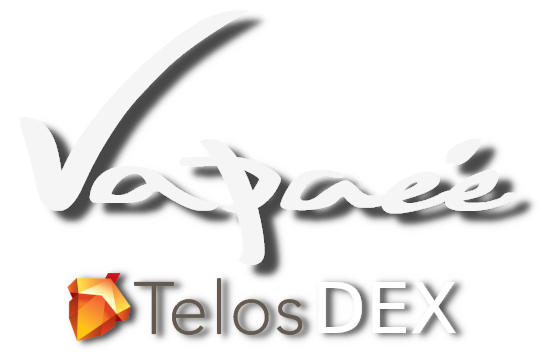

Vapaée - worker proposal 2
--------------------------

# Financing the development of DEX Vapaee.io and the production of its review video.

## Intro

Hello, everybody. My name is [Viterbo](https://steemit.com/introduceyourself/@viterbo/i-am-an-entrepreneur-and-i-m-going-to-build-a-dapp-over-eos) and if you don't know me already from the Telegram Telos groups, I'm responsible for the [Cards & Tokens](http://cardsandtokens.com) platform that will run on Telos, and also I'm the creator of [Vapaée.io](https://vapaee.io) Telos first DEX already deployed on the main net (in an alpha version with fake tokens to test without risks).
Please [login with scatter](https://vapaee.io/exchange/account/) and try it.

This [Vapaée.io](https://vapaee.io) DEX was planned as a submodule of the [Cards & Tokens](http://cardsandtokens.com) platform (that covers the "Tokens" part) and bring a lot of token services to other Dapps and users (including token exchange). Although it had low priority, [something made me change my mind](https://steemit.com/telos/@viterbo/vapaee-first-telos-dex) and I decide to start on this module.

## Budget Summary

This worker proposal is for **2 cycles of 200K TLOS each**. Only 30K of the first cycle will be sold in the market. The rest will remain as a future personal investment and, hopefully, will never be sold, but used as currency.

- **Cycle 1** - 200K TLOS
  - Develoment of the **Premium** version of [Vapaée.io](https://vapaee.io)
  - Plus one review video of [Cards & Tokens](http://cardsandtokens.com), [Vapaée.io](https://vapaee.io) and Telos blockchain by [Louis Thomas](https://www.youtube.com/channel/UCpceefaJ9vs4RYUTsO9Y3FA) from the UK.

- **Cycle 2** - 200K TLOS
  - Develoment of the **Deluxe** version of [Vapaée.io](https://vapaee.io)

## Versions

I separated the whole development of the [Vapaée.io](https://vapaee.io) DEX in three different parts: **Basic**, **Premium**, and **Deluxe**.     

The **Basic** version is the one that is already up and running on Telos MainNet (although it's missing a couple of features). This version is my way to say **THANK YOU, Telos community!!** And at the same time, return the value that you already had given to me with the approval of my last WP [(number #7)](https://chainspector.io/dashboard/working-proposals/7). So I will finish this **Basic** version independently if this current WP is approved or not.
You will get a finished DEX, I think I owe you that.

For the **Premium** and **Deluxe** versions, you will be able to choose if you want them separately. If you approve this WP, you will get the next version upgrade. If not, I will go back to work on the "Cards" part of the [Cards & Tokens](http://cardsandtokens.com) platform.

- **Basic** (v1.x.x)     
  This one is already deployed and ready to test. It only requires 2 more important features such as trading history chart and Sqrl wallet support. The rest is already up and running on Telos main net. The completion of this version does not depend on the approval of this worker proposal. **I will finish it because we need it**.    
  This verison includes:
  - **Test period**: currently there is a testing period when you can use fake Tokens to try this DEX without using real ones.
  - **No restrictions**: all standard tokens on Telos network will be listed (with the exception of FLAME), and no restriction will exist to list new ones.
  - **Orders**: users already can create trade-orders or match existing ones to trade tokens for TLOS, p2p with another Telos user using the **vapaeetokens** contract as DEX.
  - **Chart**: an appropriate chart will be implemented to display graphically the trading transaction history of any token.
  - **Sqrl support**: actually only Scatter is supported. I will add Sqrl support too.

- **Premium** (v2.x.x)     
  This one is a refined and more polished version than the previous one, which includes basically a lot of work in the presentation layer or the front-end, that in this case would be the website.   
  This version includes:
  - **Responsive Design**: currently the trade page has a lot of components on stage at the same time, and they all do not fit when the screen is lower than full-HD. I will create a better and more responsive design for this page (and the other pages too). In fact, I will make it work as a [PWA (Progresive Web Application)](https://www.youtube.com/watch?v=fuhAmUpEEHA) to fit on cell phone screens.
  - **Last 24h info**: add more information about the token movement of the last 24h (like min price, max price, transactions count).
  - **Token info page**: each token should have its own page with all its info (title, description, links, video, contacts, transaction history, top N holders, etc).
  - **Prices in TLOS/USD/XXX**: Display all prices of all tokens in your preferred currency. You will have a combo box to choose your preferred currency and all the prices will be expressed in that currency. The list will include TLOS, EOS, BTC, ETH, USD, EUR, etc.
  - **Activity feedback**: display feedback on DEX activity on the home page (how many users, transactions per day, deposits, withdraws, earnings, etc).
  - **Review Video**: work in coordination with [Louis Thomas](https://www.youtube.com/channel/UCpceefaJ9vs4RYUTsO9Y3FA) to make a review video of this project and the Telos itself.

- **Deluxe** (v3.x.x)     
  This final version is really a combination of more UI refinement plus adding new token services and DEX features. This will require lots of modifications on both, the smart contract and the website. If you approve the second cycle of this WP we will have a **deluxe DEX**.     
  This version includes:
  - **Token Auction**: users will be able to put any amount of any token to be auctioned and get paid in a specific currency and have all tokens sold in a specific time. This allows you to automatically convert any amount of token X to the best amount of token Y in a specific period of time, having the smart contract selling little amounts of X periodically in your name to the best Y offer each time.
  - **Vapaee Token / Passive Income**: as you can imagine there's a very little fee that both parts of the deal have to pay on each transaction and that determines the earnings of the contract. I will create a Vapaée Token that can be staked for passive income funded by these earnings.
  - **Free to join**: The contract **vapaeetokens** already admit anyone to create and/or register any standard token on Telos but the website has no interface for that. I will create a very intuitive page to create a new token on the **vapaeetoken** smart contract or register an existing one along with all the token info. All registered tokens will get listed in the exchange automatically.
  - **Timezone**: currently the time displayed for the transactions is the blockchain date time. I will implement an easy way to set the user's local timezone to display the date times in local time. In fact, I will make the website to detect and set automatically the local timezone for the user.
  - **Trade any pair**: something that I came across when I developed the first version is that you can see a sell-order (you have X and wants to sell it for Y) as an inverse of a buy-order (where you have X and wants to use it as payment for Y). It's the same trade but with two different points of view. The smart contract already models the trading market this way. Now I can implement a button, that if you press it, you will invert the XXX / YYY trading pair for YYY / XXX, and all the buy-orders will convert to sell-orders and the opposite will happen with the sell-orders.      
  At this time we may have IBC running and we may have an EOS representative token on Telos network that can be added to this DEX. Then you will be able to see the TLOS being priced in EOS and vice versa in Vapaée.io.
  - **Contract Events**: to be a really useful tool, all Dapps owning any token being traded in this DEX should be able to 'react' when any event involving its token occurs. eg: deposits, withdraws, order, transaction, etc. So the **vapaeetokens** smart contract should be modified to send a signal to the Dapp contract owning the token involved in the event.      
  This will allow, for example, the current Telos voting system to update your "voting power" taking in account your deposits and earnings in the DEX, without you to actually having to withdraw your TLOS for that.
  - **Skins**: finally, the strawberry of the cake, I will adding a few different skins for you to choose.

## Review Video by Louis Thomas

If you don't know him, Louis Thomas is a very well known crypto influencer who has a very popular [channel on youtube](https://www.youtube.com/channel/UCpceefaJ9vs4RYUTsO9Y3FA) where he talks about crypto projects like this one. He has an enormous amount of followers (almost 100K users) all around the world (Asia 50%, Europe 35% . America 10%, Africa 5%).

We have been talking about working together to create a review video to publicize this project and the Telos blockchain itself. He estimates that a review video for this project can have over 35k views in the first 3 weeks.

If you approve the first cycle, you will be funding the Premium version development plus this review video. At the time this video hits the public, we will have this Premium version released and running, ready to receive all new investors that come from the video post.

## Roadmap

The following are estimated release dates for each version:

- **May 20th - Basic**: this day will be enabled the trading with real tokens. We will have a functional chart and Sqrl wallet support.
- **June 10th - Premium**: at this day we will have a much better interface website. It will become a reference site because telos users will be able to check their balances expressed in USD (or any other preferred currency).    
We also have a great review video by [Louis Thomas](https://www.youtube.com/channel/UCpceefaJ9vs4RYUTsO9Y3FA) that will bring a lot of users to the DEX and the blockchain.
- **July 08th - Delux**: at this point, we will have an excellent competitive product, with lots of new and innovative features, such as token auctioning or Vapaée token passive income. The development of this version will be harder than previous ones and therefore will take more time to finish.

